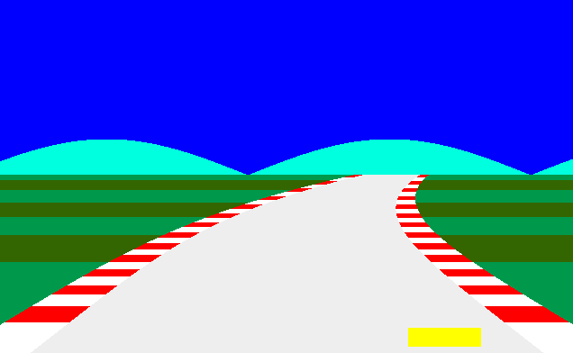

# Retro Race

Retro Race is a vanilla C++ racing game inspired by classic Master System racing games. It features retro-style graphics, simple gameplay mechanics, and a nostalgic feel for fans of old-school racing games.

## Screenshots

Here are some screenshots of the game:



## Description

In Retro Race, players take control of a car and race through winding tracks with varying curvatures and challenges. The game simulates a retro racing experience with pixelated graphics and smooth gameplay. Players can accelerate, brake, and steer their car to navigate the track while avoiding going off-road.

### Features:

The game is built using SDL2 for graphics and audio, and it includes features like:

- Dynamic track curvature and speed adjustments.
- Retro-style visuals and color schemes.
- Simple and intuitive controls for a nostalgic racing experience.

## How to Play

1. Use the arrow keys to move.
2. Enjoy the race experience!

## Build and Run

To build and run the game, use the provided `Makefile`:

```bash
make build
make run
